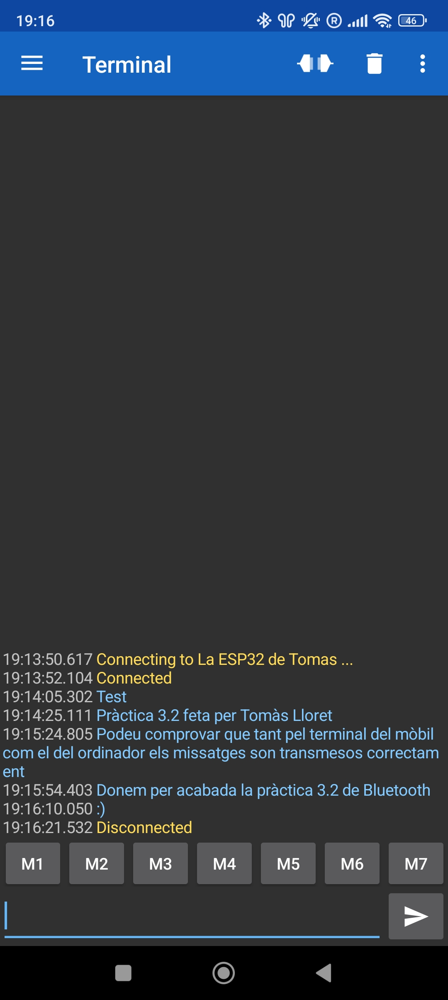
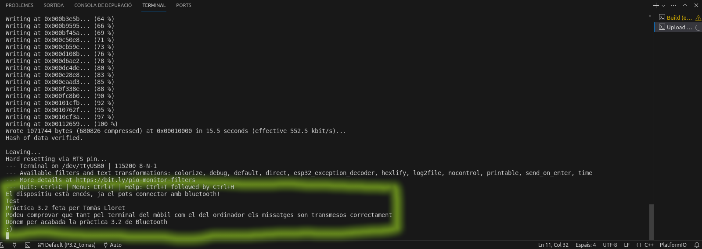

# PRACTICA 3: WIFI I BLUETOOTH
### Autor: Tomàs Lloret

L'objectiu d'aquesta pràctica és entendre el funcionament de la WiFi i el Bluetooth fent un servidor web amb el nostre ESP32 i generant una comunicació en serie amb bluetooth entre aquest i el nostre telèfon mòbil.

## Part A: Generació d'una pàgina web
Iniciem el codi incloent les llibreries necessàries per a poder utilitzar el wifi i fer el web server. Després, creem dues variables constants on introduirem les dades del wifi al que ens connectarem, o sigui el seu SSID i la contrasenya. Finalment, definim el port HTTP que utilitzarà el web server, el qual serà el port per defecte (en aquest cas, el 80).
```c
#include <WiFi.h>
#include <WebServer.h>
#include <Arduino.h>
void handle_root();

// SSID & Password
const char* ssid = "Xiaomi_11T_Pro"; 
const char* password = "12345678"; 
WebServer server(80);
```

Establim la velocitat de comunicació del dispositiu en 115200 i fem el conjunt de funcions que realitzen la connexió i comuniquen l'estat d'aquesta.
```c
void setup() {
    Serial.begin(115200);
    Serial.println("Try Connecting to ");
    Serial.println(ssid);
    // Connecta al teu modem
    WiFi.begin(ssid, password);
    // Mira si la wifi te connexió a internet
    while (WiFi.status() != WL_CONNECTED) {
        delay(1000);
        Serial.print(".");
    }
    Serial.println("");
    Serial.println("WiFi connected successfully");
    Serial.print("Got IP: ");
    Serial.println(WiFi.localIP()); 
    server.on("/", handle_root);
    server.begin();
    Serial.println("HTTP server started");
    delay(100);
}
```

Escrivim la funció "handleClient()" que servirà per a rebre peticions del servidor.
```c
void loop() {
    server.handleClient();
}
```

Per acabar, fem el codi HTML o CSS (en el nostre cas, el primer) que mostrarà el nostre servidor.
```c
// Contingut HTML & CSS a mostrar
String HTML = "<!DOCTYPE html>
<head>
    <meta charset="UTF-8">
    <meta name="viewport" content="width=device-width, initial-scale=1.0">
    <title>La meva primera pàgina feta amb l'ESP32</title>
</head>
<body>
    <h1>La meva primera pàgina feta amb l'ESP32</h1>
    <p>Aquest és el meu primer intent de crear una pàgina web utilitzant l'ESP32. :)</p>
</body>
</html>
";
// Root url (/)
void handle_root() {
    server.send(200, "text/html", HTML);
}
```

### Part A: Codi complet
```c
// P3.1
// Autor: Tomàs Lloret
#include <WiFi.h>
#include <WebServer.h>
#include <Arduino.h>
void handle_root();

// SSID & Password
const char* ssid = "Xiaomi_11T_Pro"; 
const char* password = "12345678"; 
WebServer server(80);

void setup() {
    Serial.begin(115200);
    Serial.println("Try Connecting to ");
    Serial.println(ssid);
    // Connecta al teu modem
    WiFi.begin(ssid, password);
    // Mira si la wifi te connexió a internet
    while (WiFi.status() != WL_CONNECTED) {
        delay(1000);
        Serial.print(".");
    }
    Serial.println("");
    Serial.println("WiFi connected successfully");
    Serial.print("Got IP: ");
    Serial.println(WiFi.localIP()); 
    server.on("/", handle_root);
    server.begin();
    Serial.println("HTTP server started");
    delay(100);
}

void loop() {
    server.handleClient();
}

// Contingut HTML & CSS a mostrar
String HTML = "<!DOCTYPE html>
<head>
    <meta charset="UTF-8">
    <meta name="viewport" content="width=device-width, initial-scale=1.0">
    <title>La meva primera pàgina feta amb l'ESP32</title>
</head>
<body>
    <h1>La meva primera pàgina feta amb l'ESP32</h1>
    <p>Aquest és el meu primer intent de crear una pàgina web utilitzant l'ESP32. :)</p>
</body>
</html>
";
// Root url (/)
void handle_root() {
    server.send(200, "text/html", HTML);
}
```

## Part B: Comunicació Bluetooth amb el mòbil
Incloem les llibreries per a habilitar el Bluetooth i definim la funció "if" que verifica si aquest està encés, posant un missatge d'error si no funciona. També anomenem al BluetoothSerial com a "SerialBT".
```c
#include <Arduino.h>
#include "BluetoothSerial.h"
#if !defined(CONFIG_BT_ENABLED) || !defined(CONFIG_BLUEDROID_ENABLED)
#error Bluetooth is not enabled! Please run `make menuconfig` to and enable it
#endif
BluetoothSerial SerialBT;
```

Dins del setup establim la velocitat de comunicació del dispositiu, el nom d'aquest i finalment fem que se'ns avisi per terminal que el dispositiu s'ha iniciat correctament i que ja ens hi podem connectar.
```c
void setup() {
    Serial.begin(115200);
    SerialBT.begin("ESP32test"); //Bluetooth device name
    Serial.println("El dispositiu està encés, ja el pots connectar amb bluetooth!");
}
```

En el loop comprobem si el bluetooth està disponible i, si la resposta es afirmativa, es llegeix i s'escriu a terminal la informacio. Després hi ha un delay de 20 milisegons i es torna a iniciar el procés.
```c
void loop() {
    if (Serial.available()) {
        SerialBT.write(Serial.read());
    }
    if (SerialBT.available()) {
        Serial.write(SerialBT.read());
    }
    delay(20);
}
```

### Part B: Codi complet
```c
#include <Arduino.h>
#include "BluetoothSerial.h"
#if !defined(CONFIG_BT_ENABLED) || !defined(CONFIG_BLUEDROID_ENABLED)
#error Bluetooth is not enabled! Please run `make menuconfig` to and enable it
#endif
BluetoothSerial SerialBT;

void setup() {
    Serial.begin(115200);
    SerialBT.begin("La ESP32 de Tomas"); //Bluetooth device name
    Serial.println("El dispositiu està encés, ja el pots connectar amb bluetooth!");
}

void loop() {
    if (Serial.available()) {
        SerialBT.write(Serial.read());
    }
    if (SerialBT.available()) {
        Serial.write(SerialBT.read());
    }
    delay(20);
}
```

### Part B: Funcionament


En aquesta primera imatge veiem els inputs fets desde l'aplicació de mòbil.


I en aquesta segona imatge veiem la sortida per terminal dels inputs fets des de l'aplicació de mòbil.
